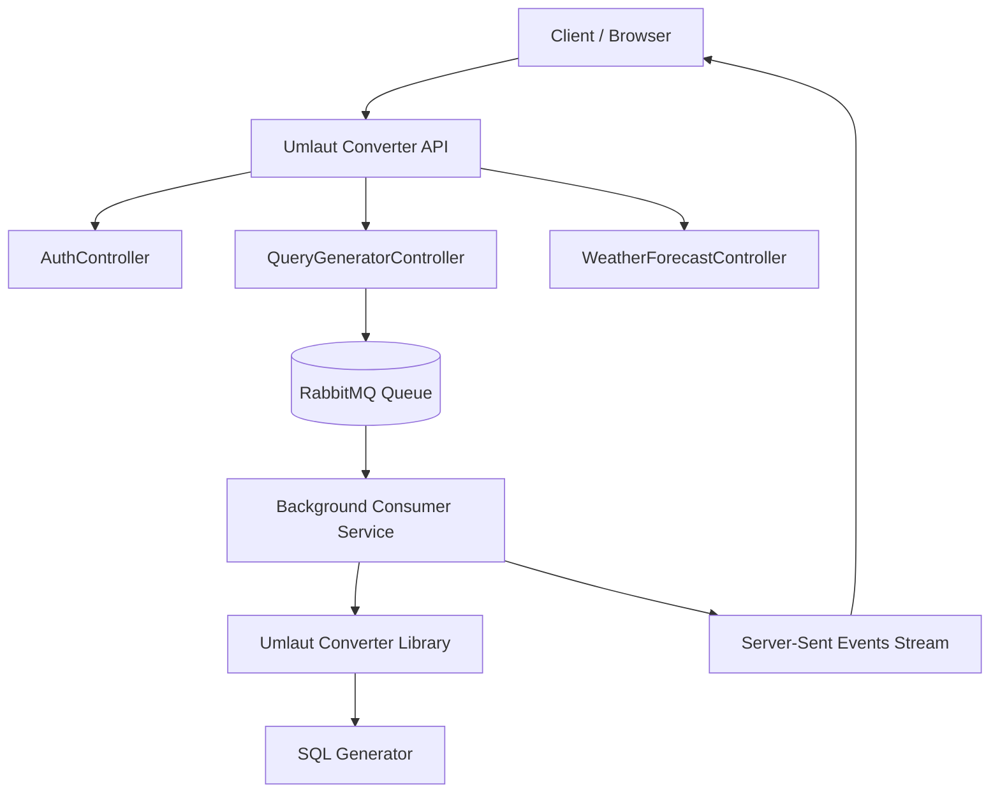

# Architecture Overview

## 1. System Overview

The **Samwin Umlaut Converter API** is designed as an **event-driven, asynchronously processed system** with **real-time push-based response streaming**.

It processes input tokens, generates variations, and produces SQL queries using a combination of:

* Message-based decoupling (RabbitMQ)
* Background processing (consumer service)
* Real-time streaming (Server-Sent Events)

### System Architecture (Logical View)

Following diagram shows **how components are connected**.




---

## 🧠 Explanation

This architecture follows a **hybrid synchronous + asynchronous model**:

* API handles authentication and request intake
* RabbitMQ decouples processing
* Background consumer processes conversion + SQL generation
* Results are pushed back using SSE

Key design principles:

* Event-driven processing
* Async decoupling via message queue
* Push-based client updates via SSE

---


## 2. Architectural Style

### 2.1 Event-Driven Architecture

The system is built around an **event-driven model**, where:

* The API publishes messages instead of executing long-running logic
* RabbitMQ acts as the central event broker
* Consumers react independently to incoming events

This enables loose coupling between request handling and processing logic.

---

### 2.2 Asynchronous Processing

All heavy processing is performed asynchronously:

* HTTP request lifecycle is short-lived
* Background consumer handles message processing
* Results are generated independently of the request thread

This improves scalability and responsiveness.

---

### 2.3 Push-Based Communication (SSE)

The system uses **Server-Sent Events (SSE)** for real-time updates:

* Server pushes incremental results to the client
* No client polling is required
* Ideal for streaming query generation results

---

## 3. High-Level Architecture Flow

```
Client
  ↓
API Layer (Auth + Request Handling)
  ↓
RabbitMQ (Event Bus)
  ↓
Background Consumer (Processing)
  ↓
Converter Library (Domain Logic)
  ↓
Event Emission (Internal Event Stream)
  ↓
SSE Stream → Client
```

---

## 4. Core Components

### 4.1 API Layer

Responsible for:

* Authentication (JWT + Google OAuth)
* Request validation
* Publishing events to RabbitMQ
* Streaming results via SSE

---

### 4.2 Message Bus (RabbitMQ)

Acts as the **decoupling layer**:

* Buffers incoming requests
* Enables asynchronous processing
* Supports retry via acknowledgment model

Queue: `my_demo_queue`

---

### 4.3 Background Consumer

A hosted service running inside the API process:

* Consumes messages from RabbitMQ
* Generates variations and SQL queries
* Emits results via internal event (`MessageReceived`)

> Note: This is a **collocated consumer model** (see Deployment Model section).

---

### 4.4 Converter Library

Encapsulates domain logic:

* Umlaut conversion logic
* Variation generation strategies
* SQL query generation (parameterized)

This ensures business logic is separated from infrastructure concerns.

---

## 5. Data Flow

### 5.1 Request Flow

1. Client sends input to API
2. API publishes message to RabbitMQ
3. Request returns immediately or begins SSE stream

---

### 5.2 Processing Flow

1. Background consumer receives message
2. Inputs are parsed and processed
3. Variations are generated
4. SQL queries are created
5. Results are emitted internally

---

### 5.3 Streaming Flow

1. Consumer emits event (`MessageReceived`)
2. API listens to internal event stream
3. SSE endpoint pushes results to client
4. Client receives real-time updates

---

## 6. Deployment Model

### 6.1 Current Model: Collocated Consumer

The RabbitMQ consumer runs inside the same API process.

### Reasons for this design:

* Simplifies deployment in constrained hosting environments
* Reduces infrastructure overhead
* Enables direct in-memory event propagation to SSE streams

---

### 6.2 Scalability Path (Future Model)

The architecture supports separation into independent services:

* API Service (stateless)
* Worker Service (RabbitMQ consumer)

This enables:

* Independent scaling of processing workload
* Fault isolation between API and processing
* Horizontal scaling of consumers

---

## 7. Design Characteristics

### 7.1 Decoupling

* API does not directly execute processing logic
* Message bus isolates responsibilities

---

### 7.2 Resilience

* RabbitMQ provides retry via Nack/Requeue
* Failures do not block API layer

---

### 7.3 Real-Time Responsiveness

* SSE provides low-latency streaming
* Results are pushed as they are generated

---

### 7.4 Observability Ready (UPDATED)

The system supports **end-to-end distributed tracing across asynchronous boundaries**, including RabbitMQ message propagation.

This enables trace continuity from:
**HTTP request → RabbitMQ publish → RabbitMQ consume → processing → SSE response**

Instrumentation details are covered in:
👉 [Observability Guide](docs/observability.md)


---

## 8. Summary

This architecture combines:

* **Event-driven design** for decoupling
* **Asynchronous processing** for scalability
* **Push-based streaming (SSE)** for real-time response delivery

It is designed to be **cloud-ready, horizontally scalable, and easily decomposable into microservices** in future iterations.
