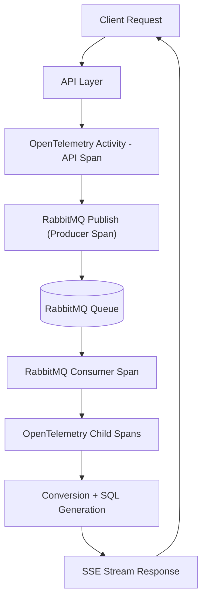

# Observability Guide

## 1. Overview

This document describes how **logs, metrics, and distributed traces** are implemented in the Samwin Umlaut Converter API.

The system uses **OpenTelemetry + NLog + custom instrumentation services** to provide full visibility across:

* API request lifecycle
* Authentication flows
* RabbitMQ-based async processing
* SQL generation pipeline
* SSE streaming responses

---

## 2. Logging Strategy

### 2.1 Structured Logging (NLog)

Logging is implemented using `ILogger<T>` with structured templates.

**Rules:**

* No string concatenation in logs
* Use parameterized messages
* Always include contextual scope

Example pattern used across controllers and services:

```csharp id="log1"
using (_logger.BeginScope(new Dictionary<string, object>
{
    { "Scope", "OperationName" },
    { "OperationId", Guid.NewGuid() }
}))
{
    _logger.LogInformation("Operation started");
}
```

---

### 2.2 Logging Scope Model

Scopes are used to enrich logs with contextual metadata.

**Standard fields:**

* `Scope` → logical operation name (e.g., `GoogleLogin`, `PublishMessage`)
* `OperationId` → correlation ID per request
* Optional metadata → input sizes, endpoint names

---

### 2.3 Log Correlation Flow

Logs can be correlated across:

* API request entry
* Authentication step
* RabbitMQ publish/consume
* SQL generation
* SSE streaming output

This is achieved using:

* `Scope`
* `OperationId`
* consistent structured logging

---

## 3. Distributed Tracing (OpenTelemetry)

### 3.1 Trace Infrastructure

Tracing is implemented using:

* `ActivitySource` (via `ActivityService`)
* OpenTelemetry ASP.NET Core instrumentation
* HTTP + runtime + process instrumentation

Activity source name:

```text id="trace1"
samwin-umlaut-converter-api
```

---

### 3.2 Tracing Implementation Points (from code)

Tracing is explicitly added at key business and infrastructure boundaries:

#### API Layer (Controllers)

* AuthController:

  * `ValidateUserCredentials`
  * `GenerateJwt`
* QueryGeneratorController:

  * request handling scope
  * message publishing

---

#### Authentication Flow

* Google login validation
* JWT generation (`CreateToken`)
* Password login validation
* JWT issuance timing

---

#### Messaging (RabbitMQ)

* `PublishMessage`
* `ReceiveMessage`

From `MessageBusClient`:

```csharp id="trace2"
using (_activityService.StartActivity("PublishMessage"))
```

and:

```csharp id="trace3"
using (_activityService.StartActivity("ReceiveMessage"))
```

---

#### SQL Generation Pipeline

Inside consumer flow:

* token conversion
* query generation
* variation creation

These are indirectly traced via:

* message processing activity
* scoped execution blocks

---

#### SSE Streaming

* `ReceivedQuery` activity in QueryGeneratorController
* `Beats` / heartbeat stream (logical flow tracking)

---

Here is the **fully updated 3.3 section**, aligned with your current document and including your new RabbitMQ distributed tracing change.

---

## ## 3.3 End-to-End Trace Flow (UPDATED)

A full request now includes **end-to-end distributed tracing across synchronous and asynchronous boundaries**, including RabbitMQ message propagation.

This allows a single trace to represent the complete lifecycle from API request to final streamed response.

---

### Updated Flow

```text id="traceflow_updated"
HTTP Request
  → Auth / Validation
  → API Controller Activity
      → PublishMessage (Producer Activity)
          → RabbitMQ (trace context injected into message headers)
              → ConsumeMessage (Consumer Activity linked via extracted context)
                  → Token Conversion
                      → SQL Query Generation
                          → Variations Created
                              → MessageReceived Event
                                  → SSE Stream Response
```

#### Distributed Tracing & Observability Flow
This diagram shows **how a single request flows across services with OpenTelemetry**



---

## 🧠 Explanation

This diagram highlights **distributed tracing continuity**:

### 🔗 Key mechanism

* Producer injects trace context into RabbitMQ headers
* Consumer extracts and continues the same trace
* Activities are linked via parent-child spans


---

### What is included in this trace

This end-to-end trace includes:

* API request handling lifecycle
* Authentication and authorization steps
* RabbitMQ message publishing with injected trace context
* RabbitMQ message consumption with extracted parent context
* Background processing (token conversion and SQL generation)
* Internal event propagation (`MessageReceived`)
* SSE streaming back to the client

---

### Key improvement in current implementation

With the addition of **OpenTelemetry context propagation in RabbitMQ**:

* Producer and consumer activities are now part of the same distributed trace
* Message headers carry trace context (`Activity.Context` + `Baggage`)
* Consumer activities are created as **child spans of the producer**
* Full request correlation is preserved across async boundaries

---

### Outcome

This enables:

* Full visibility of async processing delays
* End-to-end latency tracking (API → queue → processing → response)
* Root cause analysis across distributed workflows
* Unified tracing for event-driven architecture

---


---

## 4. Metrics

All metrics are implemented via `MetricsService` using OpenTelemetry Meter API.

Meter:

```text id="metrics1"
samwin-umlaut-converter-api.Metrics
```

---

### 4.1 Request Metrics

#### RequestCounter

Tracks total API usage:

* Incremented per endpoint call
* Tagged with endpoint name

Example usage:

```csharp id="metrics2"
_metricsService.RequestCounter.Add(1, new TagList
{
    { "endpoint", nameof(GoogleLogin) }
});
```

---

### 4.2 Authentication Metrics

#### LoginAttempts

Tracks authentication success/failure:

* Google login
* Password login

Tags:

* `result = success | failure`

---

### 4.3 Processing Metrics

#### TokensConverted

Incremented when:

* input tokens are processed in consumer
* number of inputs received from queue

---

#### QueriesGenerated

Tracks number of SQL queries produced per input batch.

---

#### VariationsCreated

Tracks number of variations generated per SQL query.

---

### 4.4 Performance Metrics

#### JwtGenerationTime (Histogram)

Measures JWT creation latency in milliseconds.

Captured in:

* `LoginWithPassword` endpoint

Example:

```csharp id="metrics3"
_metricsService.JwtGenerationTime.Record(sw.Elapsed.TotalMilliseconds);
```

---

## 5. OpenTelemetry Export Configuration

The system exports telemetry via OTLP to external observability platforms.

Configured in `Startup.cs`:

### 5.1 Traces Export

* Endpoint: `/v1/traces`
* Protocol: HTTP Protobuf
* Service name: `samwin-umlaut-converter-api`

---

### 5.2 Metrics Export

* Endpoint: `/v1/metrics`
* Same authentication mechanism (Basic header)

---

## 6. Grafana Observability Stack

The system is designed to integrate with a full Grafana stack:

### 6.1 Traces (Tempo)

Used to visualize:

* request → queue → consumer → SSE flow
* latency across async boundaries

---

### 6.2 Metrics (Prometheus)

Used for:

* throughput monitoring
* authentication trends
* processing volume tracking

---

### 6.3 Logs (Loki via NLog targets)

Used for:

* structured log search
* filtering by scope / OperationId
* debugging request failures

---

## 7. Correlation Strategy

Full observability correlation is achieved using:

### 7.1 OperationId

* Unique per request
* Propagated via logging scopes

### 7.2 Scope Field

* Logical grouping of operations
* Example:

  * `GoogleLogin`
  * `PublishMessage`
  * `ReceivedMessage`

### 7.3 Trace Context

* OpenTelemetry automatically propagates context across HTTP calls

---

## 8. Key Observability Characteristics

* Full **request-to-response traceability**
* Visibility into **async message processing**
* Real-time insight into **SSE streaming behavior**
* Performance monitoring of **JWT and query generation**
* Correlated logs, metrics, and traces

---

## 9. Summary

This observability implementation ensures:

* Debuggable distributed workflows
* Production-grade monitoring readiness
* Clear separation between logging, metrics, and tracing concerns
* End-to-end system visibility across synchronous and asynchronous boundaries
